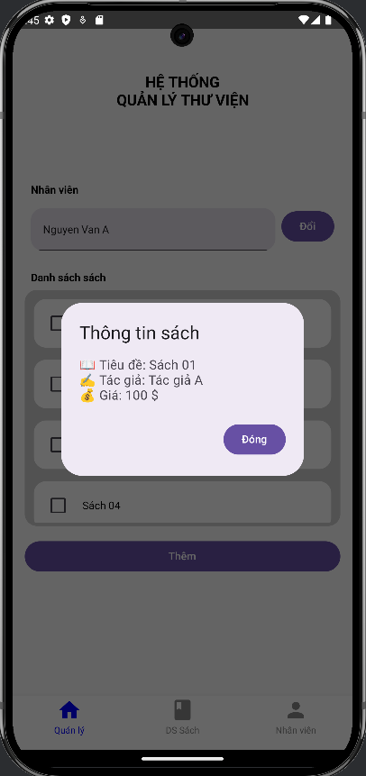

# 083205004013_NguyenHoHoangPhuc_Baitap2
## Câu 1:
- Dùng hàm OutlinedTextField để tạo các ô nhập dữ liệu đầu vào.
- Tạo fun ageCheck để kiểm tra tuổi.
- Tạo 1 biến result để lưu kết quả trả về từ fun ageCheck.
- Tạo 1 biến bool để hiển thị DiaLog khi nhấn nút "kiểm tra" và đóng DiaLog khi nút "đóng".
## Hình ảnh mô tả cho câu 1:   
  
## Câu 2:
- Tạo data class book để chứa thông tin sách.
- Dùng LazyColumn để hiển thị danh sách sách.
- Hiện DiaLog chứa thông tin sách khi nhấn vào sách.
## Hình ảnh mô tả cho câu 2: 
- Giao diện ứng dụng: 
- DiaLog: 